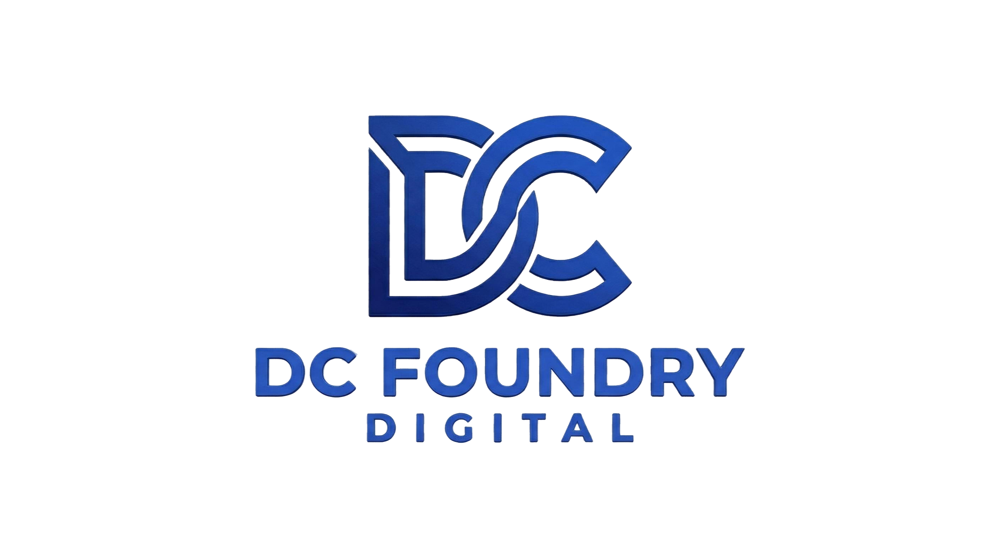

<div align="center">


<br/>



[](https://git.io/typing-svg)

<br/>

<a href="https://dcfoundrydigital.com">
  
</a>

<br/><br/>

<a href="https://linkedin.com/in/vitor-henrique-camillo">
  
</a>
<a href="mailto:vitorcamilloh@gmail.com">
  
</a>
<a href="https://camillox2.itch.io/sapphire-days">
  
</a>
<a href="https://github.com/Camillox2">
  
</a>
<a href="https://dcfoundrydigital.com">
  
</a>

<br/><br/>


</div>

---

##  &nbsp; About Me


```typescript
const vitor: Developer = {
  name     : "Vitor Henrique Camillo",
  location : "Curitiba, PR — Brazil",
  education: "Software Engineering @ Universidade Positivo",
  semester : "7th Period · Graduating 2026",
  company  : "DC Foundry Digital (Founder & CEO)",
  website  : "dcfoundrydigital.com",

  expertise: [
    "Mobile Development  (React Native · Flutter)",
    "Backend Engineering (Java Spring Boot · Node.js)",
    "Full Stack Web      (Next.js · React · Angular)",
    "AI Integration      (Gemini AI · NVIDIA Jetson)",
  ],

  highlight: "Speaker at Viasoft Connect · NVIDIA AI Certified",
  building : "Sapphire Days — Visual Novel (Ren'Py)",
};
```

<br clear="right"/>

---

##  &nbsp; Tech Stack

<div align="center">

### Mobile & Frontend


### Backend & Languages


### Database & DevOps


</div>

---

##  &nbsp; Professional Journey

<div align="center">

```
━━━━━━━━━━━━━━━━━━━━━━━━━━━━━━━━━━━━━━━━━━━━━━━━━━━━━━━━━━━━━━━━━━━━━━━━
   DC FOUNDRY DIGITAL  ·  Founder & CEO           Jan 2026 → Present
   dcfoundrydigital.com · Curitiba, PR
━━━━━━━━━━━━━━━━━━━━━━━━━━━━━━━━━━━━━━━━━━━━━━━━━━━━━━━━━━━━━━━━━━━━━━━━
   Founded and runs DC Foundry Digital — digital solutions agency
   focused on mobile, web and full-stack development for clients.
   End-to-end project ownership from architecture to deployment.

   TECNOPONTO  ·  Software Developer (CLT)         Jun 2025 → Dec 2025
   Curitiba, PR
━━━━━━━━━━━━━━━━━━━━━━━━━━━━━━━━━━━━━━━━━━━━━━━━━━━━━━━━━━━━━━━━━━━━━━━━
   Development of time-tracking and HR management systems.
   Mobile and web solutions, Java backend and RESTful APIs.

   EVO SISTEMAS INTELIGENTES  ·  Software Intern   Jan 2025 → Jun 2025
   Curitiba, PR
━━━━━━━━━━━━━━━━━━━━━━━━━━━━━━━━━━━━━━━━━━━━━━━━━━━━━━━━━━━━━━━━━━━━━━━━
   Time-clock and attendance systems. Applied React Native, Flutter
   and Java. Contributed to modernization of legacy platforms.
```

</div>

---

##  &nbsp; Featured Projects

---

###  &nbsp; Sapphire Days — Visual Novel

> **Romance Visual Novel set on a mysterious paradise island.**
> Follow the protagonist through the stories of **4 unique heroines**, each carrying their own secrets, personality and narrative arc.
> Multiple routes, multiple endings, immersive soundtrack — built entirely with Ren'Py.

<div align="center">

| | |
|---|---|
| **Engine** | Ren'Py |
| **Platforms** | Windows · macOS · Linux |
| **Genre** | Visual Novel · Romance · Anime |
| **Language** | Portuguese (Brazil) |
| **Session** | A few hours |
| **Status** | Prototype — v1.0 released |

<br/>

<a href="https://camillox2.itch.io/sapphire-days">
  
</a>

</div>

---

###  &nbsp; Entre Fases — Women's Health App

> Mobile app for **feminine cycle, pregnancy and menopause tracking**, powered by **Google Gemini AI** for intelligent therapeutic support. Robust Java Spring Boot backend.

<div align="center">

| Stack | Technologies |
|---|---|
| Mobile | React Native (iOS & Android) |
| Backend | Java Spring Boot |
| AI | Google Gemini |
| Database | MySQL |

<a href="https://github.com/Camillox2/Entre-Fases">
  
</a>

</div>

---

###  &nbsp; Pizzaria Web System

> Full-stack web application for pizzeria order management — shopping cart, product management, order tracking, responsive interface.

<div align="center">

| Stack | Technologies |
|---|---|
| Frontend | Next.js · React.js · Tailwind CSS |
| Backend/ORM | Node.js · Prisma · MySQL |

<a href="https://github.com/Camillox2/Pizzaria-New-28-06">
  
</a>

</div>

---

###  &nbsp; Dr. Adriano Camillo — Dental Clinic Website

> Responsive institutional website for a dental practice. Built with React.js as a freelance project.

<div align="center">

<a href="https://dradrianocamillo.com">
  
</a>

</div>

---

##  &nbsp; Certifications

<div align="center">

| Certification | Issuer | Date |
|---|---|---|
| Getting Started with AI on Jetson Nano |  NVIDIA | Apr 2026 |
| AI Capabilities and Limitations |  Anthropic | Apr 2026 |
| AI Fluency Framework & Foundations |  Anthropic | Apr 2026 |
| Segurança de Endpoint |  Cisco | Oct 2025 |
| Inglês para TI 1 — B2 Level |  Cisco | Oct 2025 |
| Master Class Gurus — TCS CodeVita Season 12 | TCS CodeVita | Nov 2024 |
| ExxonMobil Data & Analytics' Day | Universidade Positivo | Oct 2024 |
| Workshop Liderança e Comunicação | Universidade Positivo | Sep 2023 |
| Speaker — Viasoft Connect | VIASOFT | Jun 2023 |

</div>

---

##  &nbsp; GitHub Statistics

<div align="center">


<br/>


</div>

---

##  &nbsp; GitHub Trophies

<div align="center">


</div>

---

<div align="center">

<br/>

### Let's build something extraordinary.

<a href="https://linkedin.com/in/vitor-henrique-camillo">
  
</a>
&nbsp;
<a href="mailto:vitorcamilloh@gmail.com">
  
</a>
&nbsp;
<a href="https://dcfoundrydigital.com">
  
</a>

<br/><br/>

<sub><sup>
   &nbsp; Vitor Henrique Camillo · Curitiba, Brazil · <strong>dcfoundrydigital.com</strong>
</sup></sub>

<br/>


</div>
